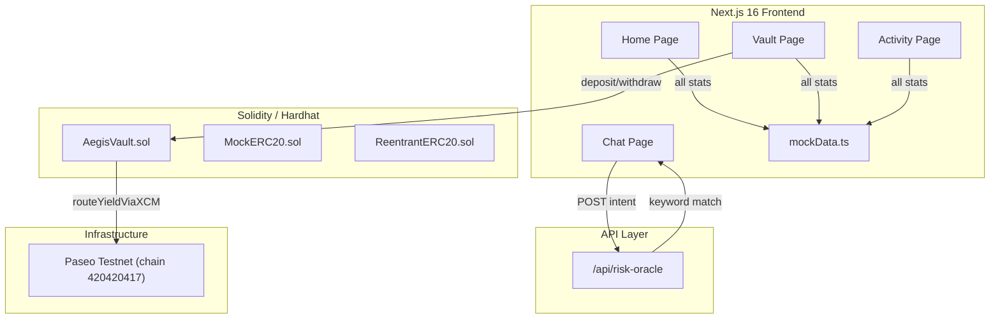

# Aegis Protocol — Comprehensive Project Report

## Project Overview

**Aegis Protocol** is an AI-guarded DeFi yield management system for the **Polkadot ecosystem**. It combines an EVM smart contract vault with a Next.js 16 frontend and an AI "risk oracle" that gates yield-routing transactions based on a risk score.

---

## Architecture Summary



---

## 1. Smart Contracts

### [AegisVault.sol](file:///Users/ekf/Downloads/Projects/Polka%20Agent/aegis%20protocol/contracts/contracts/AegisVault.sol) (258 lines)

| Feature | Detail |
|---|---|
| Solidity version | `0.8.20` |
| Inheritance | `Ownable`, `ReentrancyGuard` (OpenZeppelin 5.x) |
| Token support | Whitelisted ERC-20s via `addSupportedToken()` |
| Deposit | `deposit(token, amount)` — transfers in, updates per-user + global accounting |
| Withdraw | `withdraw(token, amount)` — checks balance, transfers out |
| XCM routing | `routeYieldViaXCM(parachainId, amount, riskScore)` — **oracle-only**, blocked if `riskScore ≥ 75` |
| AI oracle | Dedicated address that can call `routeYieldViaXCM`; updatable by owner |
| Security | `nonReentrant` on deposit/withdraw, custom errors, zero-address checks |

> [!IMPORTANT]
> `routeYieldViaXCM` only emits an event — it does **not** actually execute a cross-chain message. XCM integration is stubbed.

### Supporting test contracts
- [MockERC20.sol](file:///Users/ekf/Downloads/Projects/Polka%20Agent/aegis%20protocol/contracts/contracts/mocks/MockERC20.sol) — standard mintable ERC-20 for testing
- [ReentrantERC20.sol](file:///Users/ekf/Downloads/Projects/Polka%20Agent/aegis%20protocol/contracts/contracts/mocks/ReentrantERC20.sol) — malicious token that attempts reentrant deposit/withdraw

### Test Coverage — [AegisVault.test.js](file:///Users/ekf/Downloads/Projects/Polka%20Agent/aegis%20protocol/contracts/test/AegisVault.test.js) (442 lines)

| Test Group | Count | What's tested |
|---|---|---|
| Deployment | 2 | Owner/oracle assignment, zero-oracle revert |
| Owner controls | 5 | Token whitelisting, oracle updates, access control |
| Deposits | 5 | Happy path, multi-user, repeated, unsupported token, zero-amount |
| Withdrawals | 4 | Partial, full drain, zero-amount, insufficient balance |
| XCM routing | 4 | Below-threshold, non-oracle revert, at/above threshold, zero amount |
| State integrity | 2 | Mixed operations, large deposits |
| Reentrancy | 2 | Reentrant deposit attack, reentrant withdraw attack |

**Total: 24 unit tests** + a separate [gas usage test](file:///Users/ekf/Downloads/Projects/Polka%20Agent/aegis%20protocol/contracts/test/GasUsage.test.js).

---

## 2. Frontend (Next.js 16 + React 19)

### Tech Stack

| Layer | Technology |
|---|---|
| Framework | Next.js 16.2 (App Router) |
| React | 19.2.4 |
| Wallet | wagmi 3.5 + viem 2.47 |
| Data fetching | TanStack React Query 5.91 |
| Styling | Tailwind CSS 4.2 |
| Testing | Playwright 1.58 |

### Pages

| Route | Purpose |
|---|---|
| `/` | Landing — hardcoded stats ($24,192.40 TVL, 14.2% APY, etc.) and feature cards |
| `/vault` | Deposit/Withdraw forms + vault stats + transaction history |
| `/chat` | AI chat interface → calls `/api/risk-oracle` → offers "Execute Route" button |
| `/activity` | Yield statistics, transaction ledger, optimization notes |

### Key Components (9 total)

| Component | File | Data Source |
|---|---|---|
| [DepositForm](file:///Users/ekf/Downloads/Projects/Polka%20Agent/aegis%20protocol/frontend/components/DepositForm.tsx#20-283) | [DepositForm.tsx](file:///Users/ekf/Downloads/Projects/Polka%20Agent/aegis%20protocol/frontend/components/DepositForm.tsx) | wagmi `useWriteContract` → on-chain `deposit()` |
| [WithdrawalForm](file:///Users/ekf/Downloads/Projects/Polka%20Agent/aegis%20protocol/frontend/components/WithdrawalForm.tsx#10-204) | [WithdrawalForm.tsx](file:///Users/ekf/Downloads/Projects/Polka%20Agent/aegis%20protocol/frontend/components/WithdrawalForm.tsx) | wagmi `useWriteContract` → on-chain `withdraw()` |
| `VaultStats` | [VaultStats.tsx](file:///Users/ekf/Downloads/Projects/Polka%20Agent/aegis%20protocol/frontend/components/VaultStats.tsx) | [mockData.ts](file:///Users/ekf/Downloads/Projects/Polka%20Agent/aegis%20protocol/frontend/lib/mockData.ts) |
| `YieldStatistics` | [YieldStatistics.tsx](file:///Users/ekf/Downloads/Projects/Polka%20Agent/aegis%20protocol/frontend/components/YieldStatistics.tsx) | [mockData.ts](file:///Users/ekf/Downloads/Projects/Polka%20Agent/aegis%20protocol/frontend/lib/mockData.ts) |
| `TransactionHistory` | [TransactionHistory.tsx](file:///Users/ekf/Downloads/Projects/Polka%20Agent/aegis%20protocol/frontend/components/TransactionHistory.tsx) | [mockData.ts](file:///Users/ekf/Downloads/Projects/Polka%20Agent/aegis%20protocol/frontend/lib/mockData.ts) |
| [ChatInterface](file:///Users/ekf/Downloads/Projects/Polka%20Agent/aegis%20protocol/frontend/components/ChatInterface.tsx#25-289) | [ChatInterface.tsx](file:///Users/ekf/Downloads/Projects/Polka%20Agent/aegis%20protocol/frontend/components/ChatInterface.tsx) | `/api/risk-oracle` + wagmi |
| `WalletConnect` | [WalletConnect.tsx](file:///Users/ekf/Downloads/Projects/Polka%20Agent/aegis%20protocol/frontend/components/WalletConnect.tsx) | wagmi `useAccount` / `useConnect` |
| `Providers` | [Providers.tsx](file:///Users/ekf/Downloads/Projects/Polka%20Agent/aegis%20protocol/frontend/components/Providers.tsx) | wagmi config + React Query |
| `Navbar` | [Navbar.tsx](file:///Users/ekf/Downloads/Projects/Polka%20Agent/aegis%20protocol/frontend/components/Navbar.tsx) | Static layout |

---

## 3. AI Risk Oracle

### [/api/risk-oracle/route.ts](file:///Users/ekf/Downloads/Projects/Polka%20Agent/aegis%20protocol/frontend/app/api/risk-oracle/route.ts) (35 lines)

This is **not** a real AI model. It is a simple keyword matcher:

```typescript
const looksHighRisk =
  normalizedIntent.includes("leverage") ||
  normalizedIntent.includes("unsafe") ||
  normalizedIntent.includes("degen") ||
  normalizedIntent.includes("100x");

const riskScore = looksHighRisk ? 88 : 42;
```

- If a user's message contains "leverage", "unsafe", "degen", or "100x" → `riskScore = 88` (blocked)
- Otherwise → `riskScore = 42` (safe, `< 75` threshold)
- Parachain is matched by keyword ("acala" → 2000, "moonbeam" → 2004, etc.), defaulting to Acala

---

## 4. Data Reality — Mock vs. On-Chain

> [!CAUTION]
> **Almost all user-facing data is fabricated.** Only the deposit/withdraw forms actually attempt on-chain transactions.

| What the user sees | Source |
|---|---|
| Homepage TVL ($24,192.40) | **Hardcoded** in [page.tsx](file:///Users/ekf/Downloads/Projects/Polka%20Agent/aegis%20protocol/frontend/app/page.tsx#L4-L8) |
| Homepage APY (14.2%) | **Hardcoded** |
| Homepage Risk Score (32/100) | **Hardcoded** |
| Vault Stats panel | [mockData.ts](file:///Users/ekf/Downloads/Projects/Polka%20Agent/aegis%20protocol/frontend/lib/mockData.ts) `getVaultStats()` — returns fake balances |
| Transaction History | [mockData.ts](file:///Users/ekf/Downloads/Projects/Polka%20Agent/aegis%20protocol/frontend/lib/mockData.ts) [getTransactions()](file:///Users/ekf/Downloads/Projects/Polka%20Agent/aegis%20protocol/frontend/lib/mockData.ts#93-101) — 6 canned entries |
| Yield Statistics | [mockData.ts](file:///Users/ekf/Downloads/Projects/Polka%20Agent/aegis%20protocol/frontend/lib/mockData.ts) `getYieldStrategies()` — 5 fake strategies |
| Activity page metrics | [mockData.ts](file:///Users/ekf/Downloads/Projects/Polka%20Agent/aegis%20protocol/frontend/lib/mockData.ts) [getTransactionStats()](file:///Users/ekf/Downloads/Projects/Polka%20Agent/aegis%20protocol/frontend/lib/mockData.ts#111-133) — computed from mock txns |
| Deposit/Withdraw forms | **Real** wagmi calls to contract address from env vars |
| Chat risk scores | Keyword heuristic, no ML |

### Contract Address Configuration

```typescript
// lib/contracts.ts
export const VAULT_ADDRESS = process.env.NEXT_PUBLIC_VAULT_ADDRESS
  ?? "0x0000000000000000000000000000000000000000";
export const MOCK_TOKEN_ADDRESS = process.env.NEXT_PUBLIC_MOCK_TOKEN_ADDRESS
  ?? "0x0000000000000000000000000000000000000000";
```

Without env vars set, deposit/withdraw will target the zero address and fail silently.

---

## 5. Network Configuration

| Setting | Value |
|---|---|
| Target chain | Paseo testnet |
| Chain ID | `420420417` |
| RPC | `https://eth-rpc-testnet.polkadot.io` |
| Explorer | Blockscout (`polkadot-assethub-testnet.blockscout.com`) |

Configured in [wagmiConfig.ts](file:///Users/ekf/Downloads/Projects/Polka%20Agent/aegis%20protocol/frontend/lib/wagmiConfig.ts#L6-L19) (wagmi), [hardhat.config.js](file:///Users/ekf/Downloads/Projects/Polka%20Agent/aegis%20protocol/contracts/hardhat.config.js#L21-L25) (deployment).

---

## 6. What Works vs. What's Stubbed

| Feature | Status |
|---|---|
| Smart contract vault logic | ✅ Complete with tests |
| Reentrancy protection | ✅ Tested with malicious token |
| AI oracle gating on-chain | ✅ Risk score threshold enforced |
| Token whitelisting | ✅ Owner-controlled |
| Frontend deposit/withdraw forms | ⚠️ Wired but needs deployed contract addresses |
| Wallet connection | ⚠️ WalletConnect project ID needed |
| AI risk oracle | ⚠️ Keyword heuristic, not ML |
| XCM cross-chain routing | ❌ Event-only stub, no XCM execution |
| Real on-chain data display | ❌ All stats from mockData.ts |
| Actual yield strategies | ❌ Fabricated |
| Homepage metrics | ❌ Hardcoded strings |

---

## 7. File Structure

```
aegis protocol/
├── contracts/
│   ├── contracts/
│   │   ├── AegisVault.sol          # Main vault (258 lines)
│   │   └── mocks/
│   │       ├── MockERC20.sol       # Test token
│   │       └── ReentrantERC20.sol  # Attack simulation
│   ├── test/
│   │   ├── AegisVault.test.js      # 24 unit tests (442 lines)
│   │   └── GasUsage.test.js        # Gas benchmarks
│   ├── hardhat.config.js           # Paseo testnet config
│   └── package.json
│
└── frontend/
    ├── app/
    │   ├── page.tsx                # Landing (hardcoded stats)
    │   ├── vault/page.tsx          # Deposit/withdraw UI
    │   ├── chat/page.tsx           # AI assistant
    │   ├── activity/page.tsx       # Analytics dashboard
    │   ├── api/risk-oracle/route.ts # Keyword-based risk API
    │   ├── layout.tsx              # Root layout
    │   └── globals.css             # Tailwind + design tokens
    ├── components/                 # 9 React components
    ├── lib/
    │   ├── contracts.ts            # ABI + addresses
    │   ├── mockData.ts             # All fake data
    │   └── wagmiConfig.ts          # Chain + wallet config
    └── package.json
```

---

## 8. Summary Assessment

Aegis Protocol is a **well-structured prototype / hackathon submission** with:

1. **Solid contract layer** — clean Solidity, custom errors, OpenZeppelin guards, comprehensive test suite including reentrancy attack simulation
2. **Polished frontend** — modern stack (Next 16 / React 19 / Tailwind 4), clean component architecture, good UX patterns
3. **Clear intent** — AI-gated yield routing is a compelling narrative

**Gaps to production readiness:**
- No deployed contract addresses (zero-address fallbacks)
- No real on-chain data reads — everything shown to users comes from [mockData.ts](file:///Users/ekf/Downloads/Projects/Polka%20Agent/aegis%20protocol/frontend/lib/mockData.ts)
- Risk oracle is a keyword regex, not an actual AI model
- XCM routing is event-only with no cross-chain execution
- No WalletConnect project ID configured
- Homepage stats are hardcoded marketing numbers
